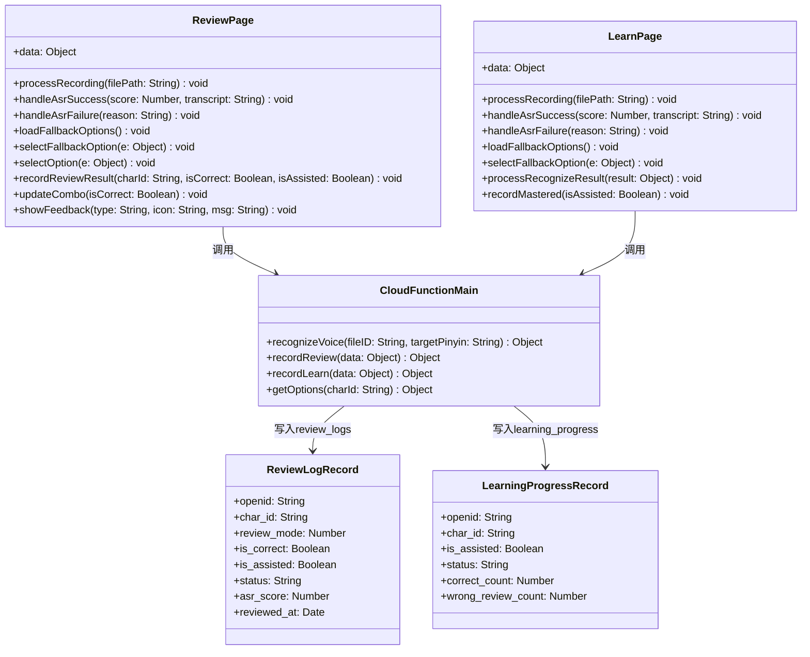
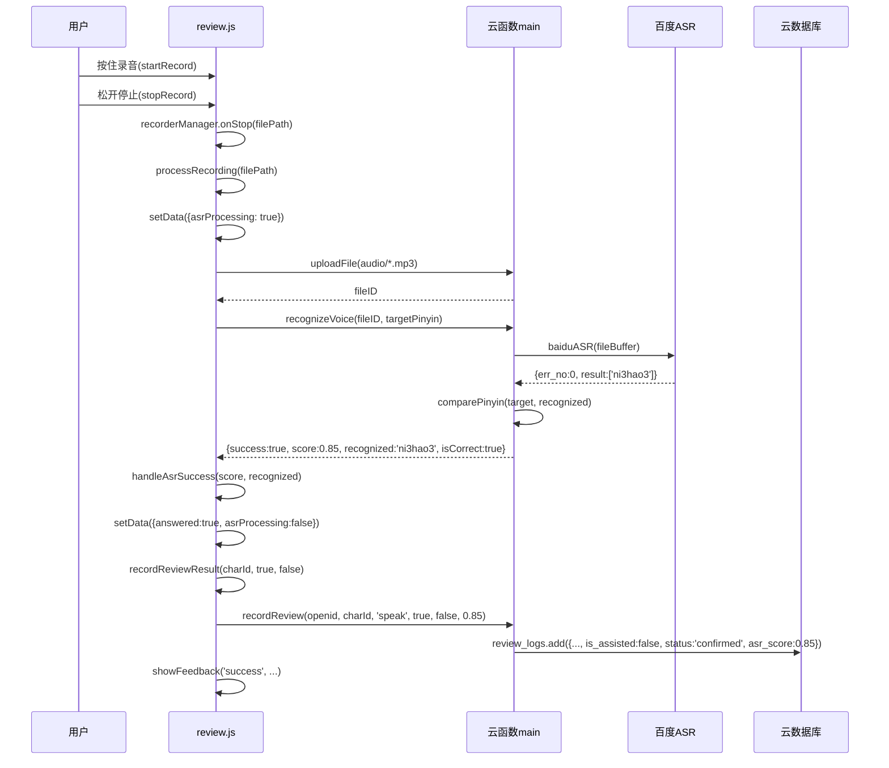
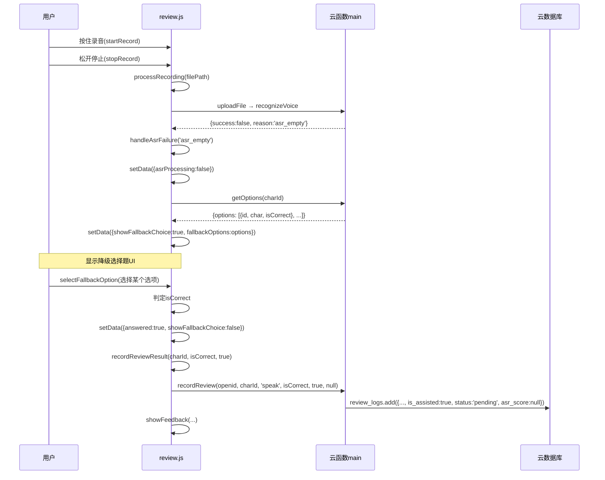
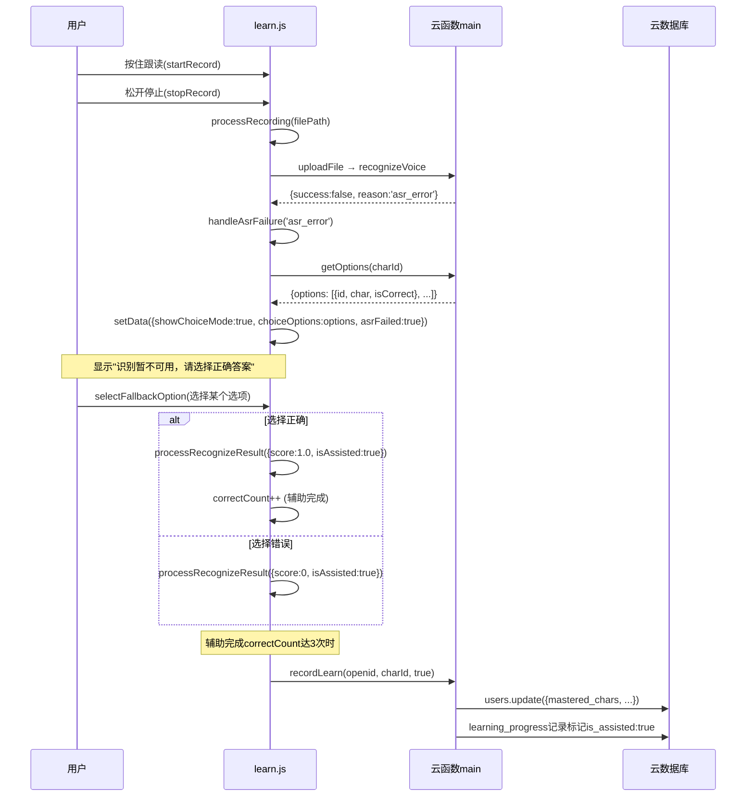
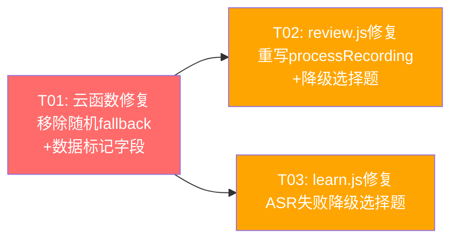

# V2.1 系统设计文档 — ASR降级修复 & 数据缺陷修正

## Part A: 系统设计

---

### 1. 实现方案分析

#### 1.1 核心技术挑战

| # | 挑战 | 严重度 | 说明 |
|---|------|--------|------|
| C1 | review.js 看字说音模式**完全没有ASR调用** | P0 | `processRecording()` 仅用 `Math.random() > 0.3` 判定，70%假阳性；且 `recorderManager.onStop` 回调未传递 `filePath`，无法上传录音 |
| C2 | learn.js ASR失败三处随机fallback | P0 | L275/280/286 三处 `Math.random() > 0.3 ? 0.85 : 0.5`，约30%学习过程数据污染 |
| C3 | 云函数 recognizeVoice 双重随机fallback | P0 | L668-683 两处 `Math.random()`，是前端随机的数据源头 |
| C4 | 降级选择题的选项来源 | 设计 | 需复用已有 `getOptions` 云函数，保证选项质量（含同音字干扰） |
| C5 | "待判定"状态的数据标记 | 设计 | review_logs / learning_progress 表需新增字段，影响已有记录兼容性 |

#### 1.2 框架与方案选择

| 决策点 | 方案 | 理由 |
|--------|------|------|
| ASR失败降级方式 | **降级为选择题**（非跳过/随机） | 选择题可验证用户是否真正认识该字；跳过无法收集数据；随机产生假数据 |
| 选择题选项来源 | **复用 `getOptions` 云函数** | 已有成熟逻辑：同音字干扰 + 随机干扰项，质量有保证 |
| 辅助完成标记 | `is_assisted: true` + `status: 'pending'` | 符合Q-1决策：算"完成"但标记辅助；Q-2：待验证通过下次复习自然修正 |
| 旧数据修正 | 不批量回退，自然修正 | 符合Q-2决策；V2.1只保证新数据正确 |

#### 1.3 架构模式

微信小程序 Page/Component 模式，云函数作为 BFF 层。无框架变更，仅修复业务逻辑。

---

### 2. 文件列表

| 文件路径 | 操作 | 说明 |
|----------|------|------|
| `pages/review/review.js` | 修改 | 重写processRecording()，新增ASR调用链+降级逻辑 |
| `pages/review/review.wxml` | 修改 | 看字说音模式新增降级选择题UI |
| `pages/review/review.wxss` | 修改 | 新增降级选择题样式 |
| `pages/learn/learn.js` | 修改 | 三处Math.random()替换为降级选择题逻辑 |
| `pages/learn/learn.wxml` | 修改 | 新增降级选择题UI区域 |
| `pages/learn/learn.wxss` | 修改 | 新增降级选择题样式 |
| `cloudfunctions/main/index.js` | 修改 | recognizeVoice去掉随机fallback；recordReview/recordLearn新增is_assisted字段 |

---

### 3. 数据结构与接口



#### 3.1 review.js data 新增字段

```javascript
// data 新增字段
showFallbackChoice: false,     // 是否显示降级选择题
fallbackOptions: [],           // 降级选择题选项
fallbackReason: '',            // 降级原因: 'asr_failed' | 'upload_failed' | 'network_failed'
asrProcessing: false           // ASR处理中状态
```

#### 3.2 learn.js data 新增字段

```javascript
// data 新增字段
showChoiceMode: false,         // 是否显示降级选择题
choiceOptions: [],             // 降级选择题选项
asrFailed: false,              // ASR是否失败
asrProcessing: false           // ASR处理中状态
```

#### 3.3 review_logs 表新增字段

| 字段 | 类型 | 默认值 | 说明 |
|------|------|--------|------|
| `is_assisted` | Boolean | false | 是否为辅助完成（降级选择题） |
| `status` | String | 'confirmed' | 状态: 'confirmed' 已确认 / 'pending' 待判定 |
| `asr_score` | Number | null | ASR原始分数（ASR成功时记录） |

#### 3.4 云函数接口变更

**recognizeVoice 返回值变更**:
```javascript
// ASR成功（不变）
{ success: true, score: 0.85, recognized: 'ni3 hao3', isCorrect: true }

// ASR失败（变更：不再随机，明确标记失败）
{ success: false, reason: 'asr_empty' | 'asr_error' }

// 异常（变更：不再随机，明确标记失败）
{ success: false, reason: 'exception' }
```

**recordReview 请求参数变更**:
```javascript
{
  openid: String,
  charId: String,
  reviewMode: String,      // 'listen' | 'speak'
  isCorrect: Boolean,
  isAssisted: Boolean,     // 新增：是否辅助完成
  asrScore: Number         // 新增：ASR分数（可选）
}
```

**recordLearn 请求参数变更**:
```javascript
{
  openid: String,
  charId: String,
  isAssisted: Boolean      // 新增：是否辅助完成
}
```

---

### 4. 程序调用流程

#### 4.1 review.js 看字说音 — ASR成功路径



#### 4.2 review.js 看字说音 — ASR失败降级路径



#### 4.3 learn.js 学习 — ASR失败降级路径



---

### 5. 不明确项与假设

| # | 问题 | 假设/处理方式 |
|---|------|--------------|
| U1 | `getOptions` 云函数在 review 模式下返回的是"听音选字"选项（选汉字），降级到选择题时也是选汉字——是否合理？ | **合理**。看字说音模式下ASR失败，降级为"选择这个字对应哪个发音"不如"选择正确的字"直观。实际场景：儿童看到字→说不出音→让他从4个字中选出正确的，验证他是否认识这个字 |
| U2 | learn.js 降级选择题中，辅助完成的correctCount是否计入3次掌握？ | **计入**（Q-1决策）。辅助完成也算完成，标记is_assisted:true，但不计入回忆正确次数（未来间隔重复算法用） |
| U3 | review.js 录音上传失败时（无fileID），是否也降级为选择题？ | **是**。uploadFile失败 → 无法调用ASR → 同ASR失败，降级为选择题 |
| U4 | learning_progress表当前schema未知（代码中仅getPendingReview读取），新增字段是否需要migration？ | **不需要**。云数据库为schema-free，新增字段直接写入即可；旧记录无is_assisted字段时默认为false |
| U5 | 降级选择题的交互——是否需要播放发音提示？ | **不主动播放**。但保留"听发音"按钮让用户自主点击，与现有listen模式一致 |

---

## Part B: 任务分解

---

### 6. 所需包

```
无新增第三方包。全部修改基于微信小程序原生API和已有云函数。
```

---

### 7. 任务列表

#### T01: 云函数修复 — 移除随机fallback + 新增数据标记字段

**源文件**: `cloudfunctions/main/index.js`

**修改内容**:
1. `recognizeVoice` (L665-684): ASR识别失败时，返回 `{success: false, reason: 'asr_empty'}`（原返回 `Math.random()` 模拟分数）；异常时返回 `{success: false, reason: 'exception'}`（原返回 `Math.random()` 模拟分数）
2. `recordReview` (L617-636): 接收新增参数 `isAssisted`、`asrScore`，写入 `review_logs` 时增加 `is_assisted`（默认false）、`status`（默认'confirmed'，辅助完成时为'pending'）、`asr_score` 字段
3. `recordLearn` (L376-436): 接收新增参数 `isAssisted`，记录到 `learning_progress` 或 `users` 表时标记辅助完成

**验收标准**:
- [ ] recognizeVoice 在ASR失败/异常时返回 `{success: false, reason: ...}` 而非随机分数
- [ ] recordReview 支持 is_assisted / status / asr_score 字段写入
- [ ] recordLearn 支持 is_assisted 字段
- [ ] 旧调用方式兼容（isAssisted缺省为false，status缺省为'confirmed'）

**依赖**: 无
**优先级**: P0

---

#### T02: review.js 修复 — 重写processRecording + 降级选择题

**源文件**: `pages/review/review.js`, `pages/review/review.wxml`, `pages/review/review.wxss`

**修改内容**:

**review.js**:
1. data新增: `showFallbackChoice`, `fallbackOptions`, `fallbackReason`, `asrProcessing`
2. 修改 `startRecord()` (L330-361): `recorderManager.onStop` 回调改为传递 `res.tempFilePath` → `self.processRecording(res.tempFilePath)`
3. **重写** `processRecording(filePath)` (L384-404):
   - 接收 `filePath` 参数
   - 上传录音文件到云存储
   - 调用 `recognizeVoice` 云函数
   - ASR成功 → 调用 `handleAsrSuccess(score, recognized)` 基于score判定
   - ASR失败 → 调用 `handleAsrFailure(reason)` 降级为选择题
4. 新增 `handleAsrSuccess(score, recognized)`: 根据score≥0.7判定正确/错误，复用现有反馈逻辑
5. 新增 `handleAsrFailure(reason)`: 调用 `getOptions(charId)` 获取选项，设置 `showFallbackChoice:true`
6. 新增 `selectFallbackOption(e)`: 处理降级选择题选择，标记 `isAssisted:true`，调用 `recordReviewResult`
7. 修改 `recordReviewResult(charId, isCorrect, isAssisted)`: 传递 `isAssisted` 和 `asrScore` 到云函数

**review.wxml**:
8. 在"看字说音模式"section (L54-69) 内，录音按钮后新增降级选择题UI:
   ```xml
   <!-- ASR处理中 -->
   <view wx:if="{{asrProcessing}}" class="asr-processing">
     <text>🔍 正在识别...</text>
   </view>

   <!-- ASR失败降级选择题 -->
   <view wx:if="{{showFallbackChoice}}" class="fallback-choice">
     <view class="fallback-hint">🔊 语音识别暂不可用，请选择正确答案</view>
     <view class="options-grid">
       <view wx:for="{{fallbackOptions}}" wx:key="id"
         class="option-item {{selectedId === item.id ? 'selected' : ''}} {{answered ? (item.isCorrect ? 'correct-pop' : (selectedId === item.id ? 'wrong-shake' : '')) : ''}}"
         bindtap="selectFallbackOption" data-id="{{item.id}}">
         <text class="option-char">{{item.char}}</text>
       </view>
     </view>
   </view>
   ```
9. 录音按钮在ASR处理中时隐藏（`wx:if="{{!asrProcessing && !showFallbackChoice}}"`）

**review.wxss**:
10. 新增 `.asr-processing` 和 `.fallback-choice` / `.fallback-hint` 样式（复用已有 `.options-grid` / `.option-item` 样式）

**验收标准**:
- [ ] processRecording 不再使用 Math.random()
- [ ] ASR成功时分数完全基于 comparePinyin 返回值
- [ ] ASR失败时显示4选项选择题，用户可选
- [ ] 降级选择题的isCorrect判定基于选项的isCorrect属性
- [ ] recordReviewResult 传递 isAssisted=true（降级时）和 asrScore（ASR成功时）
- [ ] 录音按钮在ASR处理中时不可见

**依赖**: T01
**优先级**: P0

---

#### T03: learn.js 修复 — ASR失败降级选择题

**源文件**: `pages/learn/learn.js`, `pages/learn/learn.wxml`, `pages/learn/learn.wxss`

**修改内容**:

**learn.js**:
1. data新增: `showChoiceMode`, `choiceOptions`, `asrFailed`, `asrProcessing`
2. 修改 `processRecording(filePath)` (L246-289): 三处 `Math.random() > 0.3 ? 0.85 : 0.5` 替换:
   - L275 (识别失败): 调用 `self.handleAsrFailure('asr_empty')`
   - L280 (云函数调用失败): 调用 `self.handleAsrFailure('network_failed')`
   - L286 (上传失败): 调用 `self.handleAsrFailure('upload_failed')`
3. 新增 `handleAsrFailure(reason)`: 调用 `getOptions(charId)`，设置 `showChoiceMode:true, asrFailed:true`
4. 新增 `selectFallbackOption(e)`: 处理降级选择题，传递 `{score, transcript, isAssisted:true}` 到 `processRecognizeResult`
5. 修改 `processRecognizeResult(result)` (L302-350): 支持接收 `result.isAssisted`，辅助完成时不播放Delight音效（改为温和提示）
6. 修改 `recordMastered()` (L354-396): 传递 `isAssisted` 参数到云函数 `recordLearn`
7. ASR成功时也需要处理（当前已有 `processRecognizeResult`，保持不变，仅确保不出现随机数）

**learn.wxml**:
8. 在录音按钮后新增降级选择题区域:
   ```xml
   <!-- ASR处理中 -->
   <view wx:if="{{asrProcessing}}" class="asr-processing">
     <text class="asr-text">🔍 正在识别你的发音...</text>
   </view>

   <!-- ASR失败降级选择题 -->
   <view wx:if="{{showChoiceMode}}" class="choice-mode">
     <view class="choice-hint">🔊 识别暂不可用，请选择正确答案</view>
     <view class="choice-grid">
       <view wx:for="{{choiceOptions}}" wx:key="id"
         class="choice-item {{selectedId === item.id ? 'selected' : ''}}"
         bindtap="selectFallbackOption" data-id="{{item.id}}">
         <text class="choice-char">{{item.char}}</text>
       </view>
     </view>
   </view>
   ```
9. 录音按钮在显示选择题时隐藏

**learn.wxss**:
10. 新增 `.asr-processing`、`.choice-mode`、`.choice-hint`、`.choice-grid`、`.choice-item`、`.choice-char` 样式

**验收标准**:
- [ ] 三处 Math.random() 全部移除
- [ ] ASR失败时显示4选项选择题
- [ ] 辅助完成标记 is_assisted:true
- [ ] 辅助完成的 correctCount 计入3次掌握门槛
- [ ] recordMastered 传递 isAssisted 到云函数
- [ ] ASR成功路径不受影响

**依赖**: T01
**优先级**: P0

---

### 8. 共享知识

```
- 云函数 recognizeVoice 失败时返回 {success: false, reason: 'asr_empty'|'asr_error'|'exception'}
  前端必须检查 result.success === true 才使用 score/isCorrect
- 所有 review_logs 新记录必须包含 is_assisted (Boolean) 和 status ('confirmed'|'pending') 字段
- 辅助完成 (is_assisted:true) 算"完成"但 status 为 'pending'，不计入回忆正确次数
- getOptions 云函数返回格式: {success: true, data: {options: [{id, char, isCorrect}, ...]}}
  选项已包含同音字干扰和随机干扰项，最多4个选项
- 对象方法使用 key: function(){} 格式，不用 key(){}
- 使用 var self = this + function(){} 模式保持兼容性
- 所有API调用做try-catch保护
- 降级选择题UI复用现有 options-grid / option-item 样式体系
- 旧版假数据不批量回退，通过下次复习自然修正（Q-2决策）
```

---

### 9. 任务依赖图



**说明**: T01 必须先完成（云函数接口变更后，前端才能正确处理返回值）。T02 和 T03 可并行开发，互不依赖。
