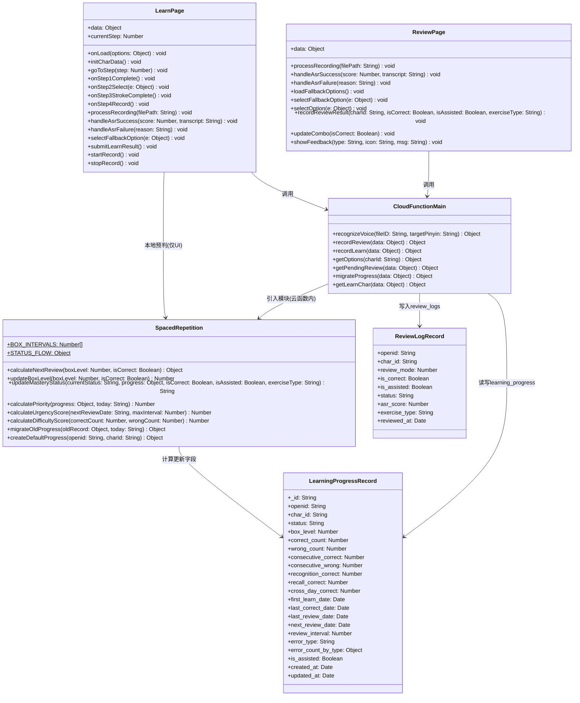
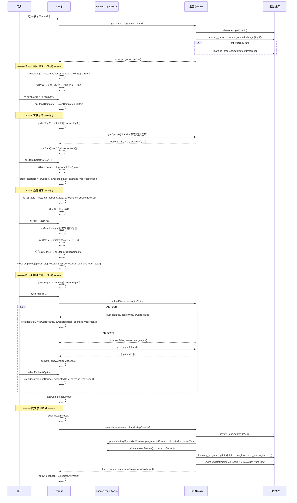
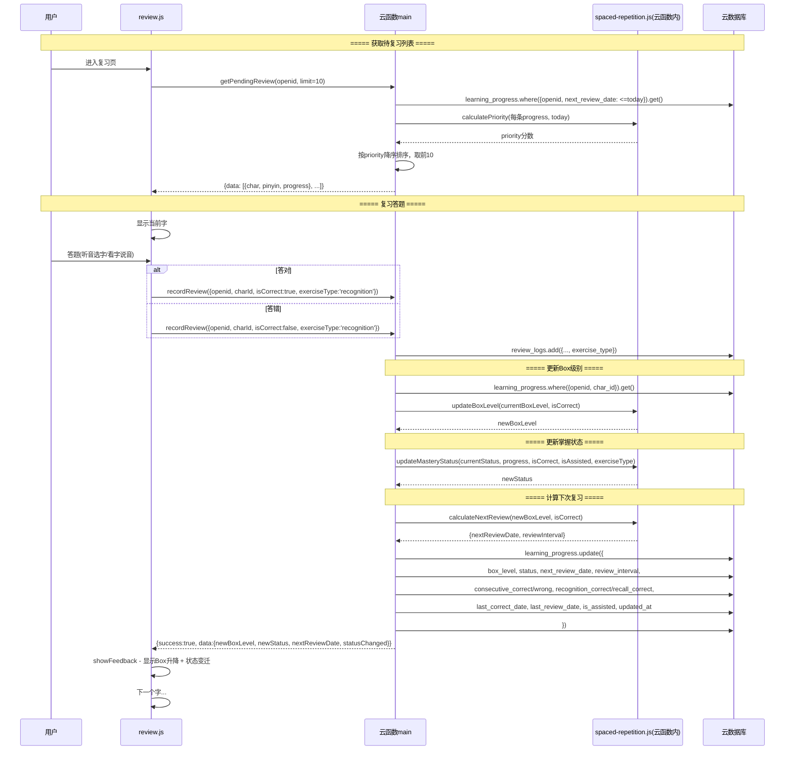
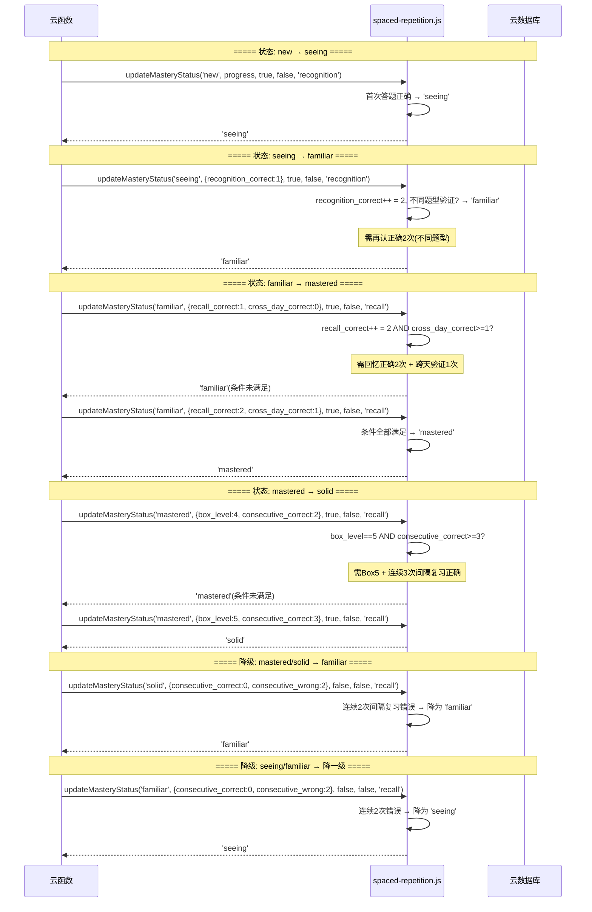
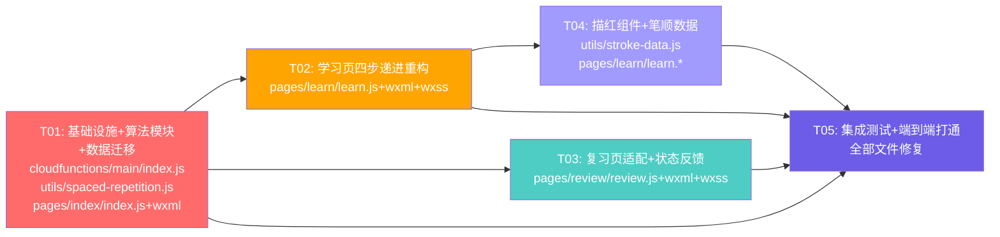

# V2.2 系统设计文档 — 间隔重复引擎 + 四步递进学习 + 掌握状态机

## Part A: 系统设计

---

### 1. 实现方案分析

#### 1.1 核心技术挑战

| # | 挑战 | 严重度 | 说明 |
|---|------|--------|------|
| C1 | 四步递进学习的页面架构：单页四步切换 vs 多页跳转 | P0 | 涉及 learn.js 大幅重构，需支持4种不同交互模式在单页内切换，状态管理复杂 |
| C2 | Leitner Box 算法与掌握状态机的联动 | P0 | Box升降直接影响状态变迁，需确保两条逻辑链不冲突：答题→Box升降→间隔更新，同时答题→连续正确/错误→状态变迁 |
| C3 | recordReview 闭环：从"只写日志"到"同步更新 learning_progress" | P0 | 当前 recordReview 仅写 review_logs，需扩展为同时更新 learning_progress 的 box_level/status/next_review_date 等字段 |
| C4 | 旧数据迁移：保守映射 + 按需迁移 | P1 | 旧 mastered_chars 数组需拆分为 learning_progress 记录；旧"掌握"映射为 familiar 而非 mastered；采用首次访问时按需迁移，不做批量回退 |
| C5 | 复习优先级算法替换现有 getPendingReview | P1 | 现有优先级用 Math.random()*5 + todayLearned*100 + wrongCount*10，需替换为 urgency*0.5 + difficulty*0.3 + random*0.2 公式 |
| C6 | 描红书写步骤的笔顺引导 | P1 | 需基于汉字 stroke 数据做路径动画，这是全新 UI 组件，需要 stroke 数据支持 |

#### 1.2 框架与方案选择

| 决策点 | 方案 | 理由 |
|--------|------|------|
| 四步递进页面架构 | **单页 learn.js 四步状态机** | 避免多页面跳转传参复杂度；一个字的学习过程应在同一页面完成；用 `currentStep` (1-4) 控制显示 |
| Leitner Box 间隔计算 | **V1固定间隔序列 [1,3,7,14,30]** | Q-3决策：V1用固定间隔，简化实现；后续版本可改为 SuperMemo 动态间隔 |
| 掌握状态机实现 | **云函数端判定** | 状态变迁逻辑集中在云函数 recordReview 中，保证数据一致性；前端仅展示状态 |
| 旧数据迁移 | **首次访问按需迁移（lazy migration）** | 用户首次进入学习/复习时，检测 learning_progress 中是否有该字记录，无则创建（含旧字段映射）；不做批量扫描 |
| 描红笔顺数据 | **内嵌简笔路径数据** | 不引入第三方包；在 characters 集合中增加 strokes 字段，存简笔路径坐标数组；V2.2 先支持约100个常用字的笔顺 |
| 优先级算法位置 | **云函数 getPendingReview 中计算** | 在服务端计算优先级，避免前端拉取全量数据；使用云数据库 where 条件过滤 next_review_date <= today 的记录 |

#### 1.3 架构模式

微信小程序 Page/Component 模式。核心变更：

1. **learn.js 从"单步学习"重构为"四步状态机"**：data.currentStep 驱动4个步骤的 UI 切换
2. **云函数 recordReview 从"只写日志"升级为"日志+状态+Box三写"**：单次调用完成 review_logs.add + learning_progress.update
3. **新增工具模块 `utils/spaced-repetition.js`**：Leitner Box 算法 + 掌握状态机 + 优先级算法，纯函数，无副作用
4. **云函数新增 `migrateProgress` 动作**：按需迁移旧数据

---

### 2. 文件列表

| 文件路径 | 操作 | 说明 |
|----------|------|------|
| `utils/spaced-repetition.js` | **新增** | Leitner Box 算法 + 掌握状态机 + 优先级算法（纯函数模块） |
| `cloudfunctions/main/index.js` | 修改 | recordReview 闭环更新 + getPendingReview 优先级算法 + migrateProgress 迁移 + 扩展字段 |
| `pages/learn/learn.js` | 修改 | 四步递进状态机 + 描红交互 + 步骤间流转逻辑 |
| `pages/learn/learn.wxml` | 修改 | 四步递进 UI 模板（step1-4 条件渲染） |
| `pages/learn/learn.wxss` | 修改 | 四步递进步骤样式 + 描红区域样式 + 步骤指示器 |
| `pages/review/review.js` | 修改 | 适配 recordReview 新返回值 + 优先级展示 |
| `pages/review/review.wxml` | 修改 | 显示 Box 级别和下次复习日期提示 |
| `pages/review/review.wxss` | 修改 | Box 级别徽章样式 |
| `pages/index/index.js` | 修改 | 首页统计数据适配新字段 + 按需迁移触发 |
| `pages/index/index.wxml` | 修改 | 展示待复习数量（基于 next_review_date） |

---

### 3. 数据结构与接口



#### 3.1 learning_progress 完整字段定义

```javascript
{
  _id: "auto",                    // 云数据库自动生成
  openid: "string",               // 用户唯一标识
  char_id: "string",              // 汉字ID（characters集合的_id或id）
  status: "string",               // 掌握状态: 'new' | 'seeing' | 'familiar' | 'mastered' | 'solid'
  box_level: 1,                   // Leitner Box 级别 1-5
  correct_count: 0,               // 总正确次数
  wrong_count: 0,                 // 总错误次数
  consecutive_correct: 0,         // 连续正确次数（答错归零）
  consecutive_wrong: 0,           // 连续错误次数（答对归零）
  recognition_correct: 0,         // 再认正确次数（Step2选择题正确）
  recall_correct: 0,              // 回忆正确次数（Step4跟读/描红正确，不含辅助）
  cross_day_correct: 0,           // 跨天验证正确次数（非当天首次正确）
  first_learn_date: null,         // 首次学习日期 ISO date
  last_correct_date: null,        // 最后正确日期 ISO date
  last_review_date: null,         // 最后复习日期 ISO date
  next_review_date: null,         // 下次应复习日期 ISO date string "YYYY-MM-DD"
  review_interval: 1,             // 当前复习间隔天数
  error_type: "",                 // 最近错误类型: 'shape_similar' | 'sound_similar' | 'stroke' | ''
  error_count_by_type: {          // 按类型统计错误次数
    shape_similar: 0,
    sound_similar: 0,
    stroke: 0
  },
  is_assisted: false,             // 最近一次是否辅助完成
  created_at: "date",             // 记录创建时间
  updated_at: "date"              // 记录更新时间
}
```

#### 3.2 spaced-repetition.js 接口定义

```javascript
// Leitner Box 固定间隔序列（天）
var BOX_INTERVALS = [1, 3, 7, 14, 30];

/**
 * 计算下次复习信息
 * @param {Number} boxLevel 当前Box级别 1-5
 * @param {Boolean} isCorrect 是否正确
 * @returns {{ boxLevel: Number, nextReviewDate: String, reviewInterval: Number }}
 */
function calculateNextReview(boxLevel, isCorrect) { ... }

/**
 * 更新Box级别
 * - 答对: boxLevel + 1 (max 5)
 * - 答错: 重置为 1
 * @param {Number} boxLevel 当前级别
 * @param {Boolean} isCorrect 是否正确
 * @returns {Number} 新级别
 */
function updateBoxLevel(boxLevel, isCorrect) { ... }

/**
 * 掌握状态机变迁
 * @param {String} currentStatus 当前状态
 * @param {Object} progress 学习进度 { recognition_correct, recall_correct, cross_day_correct,
 *   consecutive_correct, consecutive_wrong, box_level, is_assisted }
 * @param {Boolean} isCorrect 本次是否正确
 * @param {Boolean} isAssisted 是否辅助完成
 * @param {String} exerciseType 练习类型: 'recognition' | 'recall'
 * @returns {String} 新状态
 */
function updateMasteryStatus(currentStatus, progress, isCorrect, isAssisted, exerciseType) { ... }

/**
 * 计算复习优先级
 * priority = urgency_score * 0.5 + difficulty_score * 0.3 + random_score * 0.2
 * @param {Object} progress 学习进度记录
 * @param {String} today 今日日期 "YYYY-MM-DD"
 * @returns {Number} 优先级分数 0-100
 */
function calculatePriority(progress, today) { ... }

/**
 * 计算紧迫度分数
 * urgency = max(0, (today - next_review_date) / max_interval) * 100
 * @param {String} nextReviewDate 下次复习日期
 * @param {Number} maxInterval 最大间隔天数（30）
 * @returns {Number} 0-100
 */
function calculateUrgencyScore(nextReviewDate, maxInterval) { ... }

/**
 * 计算难度分数
 * difficulty = (1 - historical_accuracy) * 100
 * @param {Number} correctCount 正确次数
 * @param {Number} wrongCount 错误次数
 * @returns {Number} 0-100
 */
function calculateDifficultyScore(correctCount, wrongCount) { ... }

/**
 * 旧数据迁移映射
 * @param {Object} oldRecord 旧 learning_progress 记录
 * @param {String} today 今日日期
 * @returns {Object} 新格式记录
 */
function migrateOldProgress(oldRecord, today) { ... }

/**
 * 创建默认学习进度
 * @param {String} openid
 * @param {String} charId
 * @returns {Object} 默认 learning_progress 记录
 */
function createDefaultProgress(openid, charId) { ... }

module.exports = {
  BOX_INTERVALS: BOX_INTERVALS,
  calculateNextReview: calculateNextReview,
  updateBoxLevel: updateBoxLevel,
  updateMasteryStatus: updateMasteryStatus,
  calculatePriority: calculatePriority,
  calculateUrgencyScore: calculateUrgencyScore,
  calculateDifficultyScore: calculateDifficultyScore,
  migrateOldProgress: migrateOldProgress,
  createDefaultProgress: createDefaultProgress
};
```

#### 3.3 云函数 recordReview 接口变更

**请求参数变更**:
```javascript
{
  openid: "string",
  charId: "string",
  reviewMode: "string",        // 'listen' | 'speak'
  isCorrect: "boolean",
  isAssisted: "boolean",       // V2.1已有
  asrScore: "number",          // V2.1已有，可选
  exerciseType: "string"       // V2.2新增: 'recognition' | 'recall'
}
```

**返回值变更**:
```javascript
{
  success: true,
  data: {
    // 复习后更新结果（供前端展示反馈）
    newBoxLevel: 3,
    newStatus: "familiar",
    nextReviewDate: "2025-07-15",
    reviewInterval: 7,
    // 状态变迁提示（如有）
    statusChanged: true,
    previousStatus: "seeing",
    currentStatus: "familiar"
  }
}
```

#### 3.4 云函数 getPendingReview 接口变更

**请求参数不变**: `{ openid, limit }`

**内部逻辑变更**: 使用优先级算法排序，替代现有 `Math.random()*5 + todayLearned*100 + wrongCount*10`

**返回值变更**:
```javascript
{
  success: true,
  data: [
    {
      id: "xxx",
      char: "大",
      pinyin: "dà",
      // V2.2新增：学习进度摘要
      progress: {
        box_level: 2,
        status: "seeing",
        next_review_date: "2025-07-10",
        consecutive_correct: 1,
        consecutive_wrong: 0
      }
    },
    ...
  ]
}
```

#### 3.5 云函数新增 migrateProgress

```javascript
// 请求
{
  action: 'migrateProgress',
  data: { openid: "string" }
}

// 返回
{
  success: true,
  data: {
    migratedCount: 15,        // 迁移记录数
    skippedCount: 3,          // 已存在跳过数
    errorMessage: ""          // 错误信息（如有）
  }
}
```

#### 3.6 云函数新增 getLearnChar

```javascript
// 请求
{
  action: 'getLearnChar',
  data: { openid: "string", charId: "string" }
}

// 返回
{
  success: true,
  data: {
    char: { id, char, pinyin, strokes, words, meaning, image_url },
    progress: { status, box_level, ... }  // learning_progress 记录（如有）
  }
}
```

#### 3.7 learn.js data 新增字段

```javascript
// V2.2 新增 data 字段
currentStep: 1,                // 当前步骤 1-4
stepCompleted: [false, false, false, false],  // 各步骤完成状态
stepResults: [{}, {}, {}, {}], // 各步骤结果

// Step1 展示释义
showStep1: true,

// Step2 再认练习
step2Options: [],              // 再认选择题选项（3选1）
step2Answered: false,
step2Correct: false,

// Step3 描红书写
strokePaths: [],               // 笔顺路径数据
strokeIndex: 0,                // 当前笔画索引
strokeCompleted: false,        // 描红是否完成
showStrokeGuide: true,         // 是否显示笔顺引导

// Step4 跟读产出（复用V2.1已有字段 + 降级选择题）
// showChoiceMode, choiceOptions, asrFailed, asrProcessing 已有

// 学习结果
learnCompleted: false,         // 四步全部完成
finalResult: null              // 最终学习结果摘要
```

---

### 4. 程序调用流程

#### 4.1 四步递进学习流程



#### 4.2 Leitner Box 复习闭环



#### 4.3 掌握状态机变迁



---

### 5. 不明确项与假设

| # | 问题 | 假设/处理方式 |
|---|------|--------------|
| U1 | 描红笔顺数据从哪来？characters 集合中是否已有 strokes 字段？ | **已解决**。使用 hanzi-writer-data npm 包 (Make Me a Hanzi 数据)，通过 scripts/convert-stroke-data.js 自动生成 utils/stroke-data.js，覆盖全量 2256 字。笔顺遵循 GB 13000.1 规范。坐标系 1024×1024→200×200。 |
| U2 | 四步递进中，某步失败（如描红不通过）是否可以跳过？ | **可以跳过**，但标记 stepCompleted=true + stepResults.isCorrect=false。不强制每步都正确，但结果会如实记录到 review_logs |
| U3 | Step2 再认练习的"不同题型"具体指什么？ | 指不同的再认方式：看字选音（选拼音）、看字选义（选释义）、看字选图（选配图）。V2.2先实现"看字选音"和"看字选义"两种题型 |
| U4 | 旧数据迁移：mastered_chars 数组中的 charId 对应的字需要创建 learning_progress 记录吗？ | **需要**。migrateProgress 会遍历 mastered_chars，为每个字创建 learning_progress 记录（映射规则见3.2）。这是按需迁移，用户首次访问时触发 |
| U5 | 优先级算法中，next_review_date 为 null 的旧记录怎么处理？ | **视为今天需要复习**（urgency_score = 100）。migrateProgress 会为旧记录设置 next_review_date，但遗漏的记录按最高优先级处理 |
| U6 | 云函数能否 require 本地 utils/spaced-repetition.js？ | **不能直接引用**。云函数的 node_modules 需单独部署。方案：将 spaced-repetition.js 的核心逻辑**复制**到云函数文件内（作为内部函数），避免跨目录引用问题。已在 cloudfunctions/main/index.js 中内嵌实现。 |
| U7 | Step1 展示释义的组词示例和配图数据来源？ | characters 集合中需新增 `words`（组词数组）和 `meaning`（释义）字段。已有 `image_url` 字段。如无数据则显示"暂无释义" |

---

## Part B: 任务分解

---

### 6. 所需包

```
无新增第三方包。全部修改基于微信小程序原生API和已有云函数。
spaced-repetition.js 为纯逻辑模块（无依赖），代码内嵌到云函数中。
```

---

### 7. 任务列表

#### T01: 项目基础设施 + 间隔重复算法模块 + 数据迁移

**源文件**:
- `utils/spaced-repetition.js` (新增)
- `cloudfunctions/main/index.js` (修改)
- `pages/index/index.js` (修改)
- `pages/index/index.wxml` (修改)

**修改内容**:

1. **新增 `utils/spaced-repetition.js`**:
   - `BOX_INTERVALS = [1, 3, 7, 14, 30]`
   - `calculateNextReview(boxLevel, isCorrect)`: 答对→boxLevel+1取interval，答错→重置box1+interval1天
   - `updateBoxLevel(boxLevel, isCorrect)`: 答对+1(max5)，答错→1
   - `updateMasteryStatus(currentStatus, progress, isCorrect, isAssisted, exerciseType)`: 完整五级状态机，含升级降级规则
   - `calculatePriority(progress, today)`: urgency*0.5 + difficulty*0.3 + random*0.2
   - `calculateUrgencyScore(nextReviewDate, maxInterval)`: max(0, (today-next)/30)*100
   - `calculateDifficultyScore(correctCount, wrongCount)`: (1-correct/(correct+wrong))*100
   - `migrateOldProgress(oldRecord, today)`: 旧mastered→familiar+box3, 旧learning→seeing+box1
   - `createDefaultProgress(openid, charId)`: 初始化所有V2.2字段

2. **修改 `cloudfunctions/main/index.js`**:
   - 在文件顶部内嵌 spaced-repetition.js 的全部函数（因云函数无法引用utils目录）
   - `recordReview` case: 扩展为"三写"——review_logs.add + learning_progress查询/更新(box_level, status, next_review_date, consecutive_correct/wrong, recognition_correct/recall_correct, cross_day_correct, last_correct_date, is_assisted, updated_at) + 返回新状态信息
   - `getPendingReview` case: 替换优先级算法为 calculatePriority()；使用 next_review_date<=today 过滤；返回 progress 摘要
   - 新增 `migrateProgress` case: 遍历 users.mastered_chars → 为每个字创建 learning_progress 记录（保守映射）
   - 新增 `getLearnChar` case: 返回字详情+笔顺+学习进度
   - recordReview 新增 exerciseType 参数处理
   - review_logs 新增 exercise_type 字段

3. **修改 `pages/index/index.js`**:
   - onShow 中调用 `migrateProgress`（首次访问时触发，前端缓存标志位避免重复调用）
   - 首页统计增加"今日待复习"数量显示（基于 getPendingReview 返回数据）

4. **修改 `pages/index/index.wxml`**:
   - 新增"今日待复习"入口卡片，显示待复习字数

**验收标准**:
- [ ] spaced-repetition.js 所有函数可独立测试，输出正确
- [ ] recordReview 调用后 learning_progress 的 box_level/status/next_review_date 正确更新
- [ ] getPendingReview 按优先级排序，不再使用 Math.random()*5
- [ ] migrateProgress 能将旧 mastered_chars 映射为 learning_progress 记录
- [ ] 旧"掌握"映射为 familiar+box3，旧"学习中"映射为 seeing+box1
- [ ] 首页显示待复习字数
- [ ] 云函数内所有逻辑使用 ES5 语法

**依赖**: 无
**优先级**: P0

---

#### T02: 学习页四步递进重构

**源文件**:
- `pages/learn/learn.js` (修改)
- `pages/learn/learn.wxml` (修改)
- `pages/learn/learn.wxss` (修改)

**修改内容**:

1. **learn.js 大幅重构**:
   - data 新增: `currentStep`, `stepCompleted[4]`, `stepResults[4]`, `step2Options`, `step2Answered`, `step2Correct`, `strokePaths`, `strokeIndex`, `strokeCompleted`, `showStrokeGuide`, `learnCompleted`, `finalResult`
   - `onLoad`: 调用 `getLearnChar` 获取字详情+笔顺+进度，初始化 Step1
   - 新增 `goToStep(step)`: 切换步骤，setData({currentStep:step})，触发对应步骤初始化
   - 新增 `onStep1Complete()`: Step1"我认识了"按钮，标记完成，进入Step2
   - 新增 `onStep2Select(e)`: Step2 再认选择题选择，判定正确/错误，标记完成，进入Step3
   - 新增 `onStep3StrokeComplete()`: Step3 描红完成判定，标记完成，进入Step4
   - 修改 Step4 逻辑：复用V2.1已有 `processRecording`/`handleAsrSuccess`/`handleAsrFailure`/`selectFallbackOption`，完成后标记 stepCompleted[3]=true
   - 新增 `submitLearnResult()`: 四步全部完成后，调用 recordLearn 提交所有步骤结果
   - 描红交互: `onTouchStart`/`onTouchMove`/`onTouchEnd` 事件处理，canvas 绑定触摸轨迹与引导线匹配判定

2. **learn.wxml 重构**:
   - 顶部步骤指示器: ①释义 ②再认 ③描红 ④跟读，当前步骤高亮
   - `wx:if="{{currentStep === 1}}"`: Step1 释义展示区（字+配图+动画+组词+"我认识了"按钮）
   - `wx:if="{{currentStep === 2}}"`: Step2 再认练习区（3选1选项卡）
   - `wx:if="{{currentStep === 3}}"`: Step3 描红区（canvas + 笔顺引导线 + "跳过"按钮）
   - `wx:if="{{currentStep === 4}}"`: Step4 跟读区（录音按钮 + V2.1降级选择题）
   - 完成页: `wx:if="{{learnCompleted}}"` 四步完成庆祝动画

3. **learn.wxss 新增**:
   - `.step-indicator` 步骤指示器样式
   - `.step-indicator .step-item` 单个步骤圆点/数字
   - `.step-indicator .step-active` 当前步骤高亮
   - `.step-indicator .step-done` 已完成步骤
   - `.step-1-area` / `.step-2-area` / `.step-3-area` / `.step-4-area` 各步骤容器
   - `.stroke-canvas` 描红画布样式
   - `.stroke-guide` 笔顺引导线样式
   - `.recognition-options` 再认选项网格样式
   - `.step-skip-btn` 步骤跳过按钮

**验收标准**:
- [ ] 四步顺序递进，不可跳步（但单步内可跳过）
- [ ] Step1 展示字+配图+组词+释义
- [ ] Step2 3选1再认选择题，选择后显示对错反馈
- [ ] Step3 canvas描红区域，手指跟随引导线
- [ ] Step4 跟读录音+ASR降级选择题（复用V2.1逻辑）
- [ ] 四步全部完成后提交结果到云函数
- [ ] 步骤指示器显示当前进度
- [ ] 所有新增代码使用 ES5 语法 + var self = this

**依赖**: T01
**优先级**: P0

---

#### T03: 复习页适配 + 掌握状态反馈 + 首页复习入口

**源文件**:
- `pages/review/review.js` (修改)
- `pages/review/review.wxml` (修改)
- `pages/review/review.wxss` (修改)

**修改内容**:

1. **review.js 修改**:
   - 适配 `recordReview` 新返回值：展示 Box 升降动画、状态变迁提示
   - `recordReviewResult(charId, isCorrect, isAssisted)`: 新增 `exerciseType` 参数传递
   - 复习队列加载后，存储每字的 `progress` 信息（来自 getPendingReview 返回）
   - 新增 `showBoxChangeFeedback(oldLevel, newLevel)`: Box升降动画
   - 新增 `showStatusChangeFeedback(oldStatus, newStatus)`: 状态变迁提示
   - 复习完成页展示：统计 Box 变化、状态变迁情况

2. **review.wxml 修改**:
   - 每个字的复习区域新增 Box 级别徽章：`<text class="box-badge">Box {{currentProgress.box_level}}</text>`
   - 状态变迁提示弹窗：`<view wx:if="{{statusChangeMsg}}" class="status-change-toast">{{statusChangeMsg}}</view>`
   - 复习完成页新增 Box 分布统计

3. **review.wxss 修改**:
   - `.box-badge`: Box级别徽章（圆形，1-5级不同颜色）
   - `.status-change-toast`: 状态变迁提示浮层
   - `.box-up-animation`: Box升级动画
   - `.box-down-animation`: Box降级动画

**验收标准**:
- [ ] recordReview 调用后前端显示 Box 升降反馈
- [ ] 状态变迁（如 seeing→familiar）有明确提示
- [ ] exerciseType 参数正确传递到云函数
- [ ] 复习完成页展示 Box 分布统计
- [ ] Box徽章在复习界面可见

**依赖**: T01
**优先级**: P1

---

#### T04: 描红组件 + 笔顺数据 + 辅助组件样式

**源文件**:
- `pages/learn/learn.js` (修改 - Step3描红逻辑)
- `pages/learn/learn.wxml` (修改 - canvas描红区域)
- `pages/learn/learn.wxss` (修改 - 描红样式)
- `utils/stroke-data.js` (新增 - 常用字笔顺路径数据)

**修改内容**:

1. **新增 `utils/stroke-data.js`** (已由脚本自动生成):
   - 导出全量 2256 个常用字的笔顺路径数据（数据源: Make Me a Hanzi / hanzi-writer-data）
   - 格式: `{ charId: { char, strokes: [{ points: [{x, y}], direction: 'h'|'v'|'d'|'u'|'t' }] } }`
   - 提供查询函数 `getStrokeData(charId)` → 返回笔画路径数组或null
   - 笔顺遵循《现代汉语通用字笔顺规范》(GB 13000.1)
   - 生成脚本: `scripts/convert-stroke-data.js`（读取一级字表_拼音.xlsx → hanzi-writer-data → 转换）

2. **learn.js Step3 逻辑完善**:
   - 加载笔顺数据: `strokeData = StrokeData.getStrokeData(charId)`
   - canvas 触摸事件处理: `onStrokeTouchStart/Move/End`
   - 笔画轨迹匹配: 计算触摸点与引导线的平均偏移距离，<阈值则判定"跟随成功"
   - 笔画进度: 每完成一笔 strokeIndex++，显示下一笔引导
   - 全部笔画完成判定: strokeIndex === totalStrokes → onStep3StrokeComplete()
   - 无笔顺数据时: 显示"暂无笔顺数据"，3秒后自动进入Step4

3. **learn.wxml Step3 区域完善**:
   - `<canvas>` 绑定触摸事件
   - 引导线渲染: 灰色虚线显示目标笔画路径
   - 用户笔迹: 蓝色实线跟随手指
   - 笔画进度指示: "第2/5笔"

4. **learn.wxss 描红样式完善**:
   - canvas 尺寸和定位
   - 笔画引导线样式
   - 用户笔迹样式
   - 无数据提示样式

**验收标准**:
- [ ] 有笔顺数据的字（约100个）可正常描红
- [ ] 手指跟随引导线有视觉反馈
- [ ] 偏离引导线过远有提示（振动/变红）
- [ ] 全部笔画完成自动进入Step4
- [ ] 无笔顺数据时3秒后跳过，标记isCorrect=false
- [ ] canvas 使用 ES5 兼容的事件绑定

**依赖**: T02
**优先级**: P1

---

#### T05: 集成测试 + 端到端流程打通

**源文件**:
- `cloudfunctions/main/index.js` (修改 - 修复集成问题)
- `pages/learn/learn.js` (修改 - 修复集成问题)
- `pages/review/review.js` (修改 - 修复集成问题)
- `pages/index/index.js` (修改 - 修复集成问题)

**修改内容**:

1. **端到端流程验证与修复**:
   - 新字首次学习 → 四步完成 → learning_progress 创建 → status='seeing' → next_review_date正确
   - 次日复习 → getPendingReview返回该字 → 答对 → Box2+status晋升判定 → next_review_date+3天
   - 连续复习多日 → 状态从seeing→familiar→mastered→solid完整变迁
   - 答错降级 → Box1+连续错误判定 → 状态降级
   - 旧用户首次访问 → migrateProgress执行 → 旧数据正确映射

2. **数据一致性检查**:
   - review_logs 与 learning_progress 数据一致性
   - users.mastered_chars 与 learning_progress.status>=familiar 一致性
   - next_review_date 计算正确性验证

3. **边界情况处理**:
   - 网络异常时 recordReview 失败的前端容错
   - 并发答题时 learning_progress 竞态条件（云函数单实例无此问题）
   - 空复习队列时首页"今日待复习"显示0

4. **性能优化**:
   - getPendingReview 查询优化：使用云数据库索引（openid + next_review_date 复合索引）
   - migrateProgress 首次执行后前端缓存标志，避免重复调用

**验收标准**:
- [ ] 新字学习四步完成后 learning_progress 正确创建
- [ ] 复习答题后 Box 级别和掌握状态正确更新
- [ ] 旧用户首次访问数据迁移成功
- [ ] 连续多日复习状态变迁路径正确（seeing→familiar→mastered→solid）
- [ ] 答错降级路径正确（solid→familiar, familiar→seeing）
- [ ] 优先级算法排序正确（过期字排前面，正确率低的排前面）
- [ ] 所有 try-catch 保护到位，无未捕获异常
- [ ] 所有代码 ES5 语法合规

**依赖**: T01, T02, T03, T04
**优先级**: P1

---

### 8. 共享知识

```
- 云函数 spaced-repetition 算法内嵌在 cloudfunctions/main/index.js 中（非外部引用）
  前端 utils/spaced-repetition.js 用于本地预判（仅UI展示），服务端为准
- 所有 learning_progress 新记录必须包含全部V2.2字段（createDefaultProgress 保证）
- status 五级状态: 'new' | 'seeing' | 'familiar' | 'mastered' | 'solid'
  严格按状态机规则变迁，不跳级
- Box 级别 1-5，间隔序列 [1, 3, 7, 14, 30] 天（Q-3决策，V1固定间隔）
- is_assisted=true 的辅助完成：
  - 算"完成"，status可正常变迁
  - 不计入 recall_correct（回忆正确次数）
  - 计入 correct_count 和 consecutive_correct
- 所有日期字段使用 ISO 8601 格式，next_review_date 使用 "YYYY-MM-DD" 字符串
- 云数据库索引建议：learning_progress 集合创建 {openid: 1, next_review_date: 1} 复合索引
- 对象方法使用 key: function(){} 格式，不用 key(){}
- 使用 var self = this + function(){} 模式，不用箭头函数
- 所有 API 调用做 try-catch 保护
- recordReview 返回值包含 {newBoxLevel, newStatus, nextReviewDate, statusChanged}
  前端必须基于返回值展示反馈，不做本地推测
- exerciseType 值: 'recognition'（再认，Step2选择题）| 'recall'（回忆，Step3描红/Step4跟读）
- 跨天验证(cross_day_correct): last_correct_date 非今天的正确答题计入
- 旧数据迁移保守映射：旧"掌握"→familiar(box3)，因含56%假阳性(Q-2决策)
- 四步递进学习结果通过 recordLearn 提交，内部调用 recordReview 逻辑更新 learning_progress
- review_logs 新增 exercise_type 字段，区分再认/回忆
```

---

### 9. 任务依赖图



**说明**:
- T01 是基础设施，必须最先完成（算法模块 + 云函数接口 + 数据迁移）
- T02 和 T03 可并行开发（T02 依赖 T01 的云函数接口，T03 依赖 T01 的 recordReview 返回值）
- T04 依赖 T02（描红组件嵌入四步递进的 Step3 位置）
- T05 是最终集成，依赖所有前置任务
