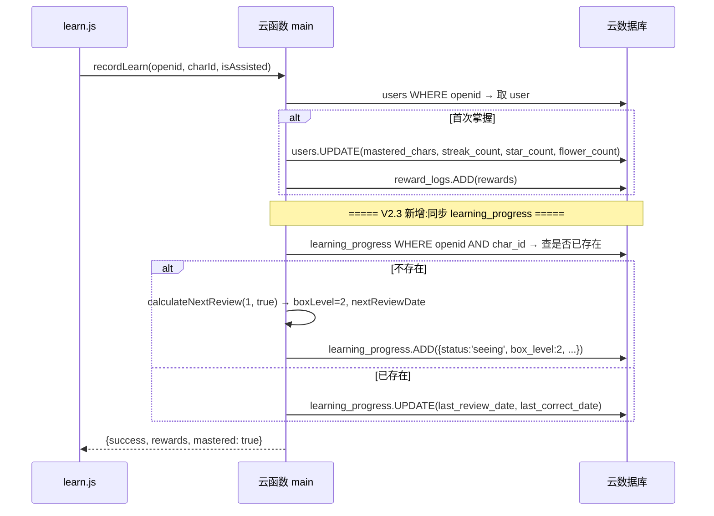
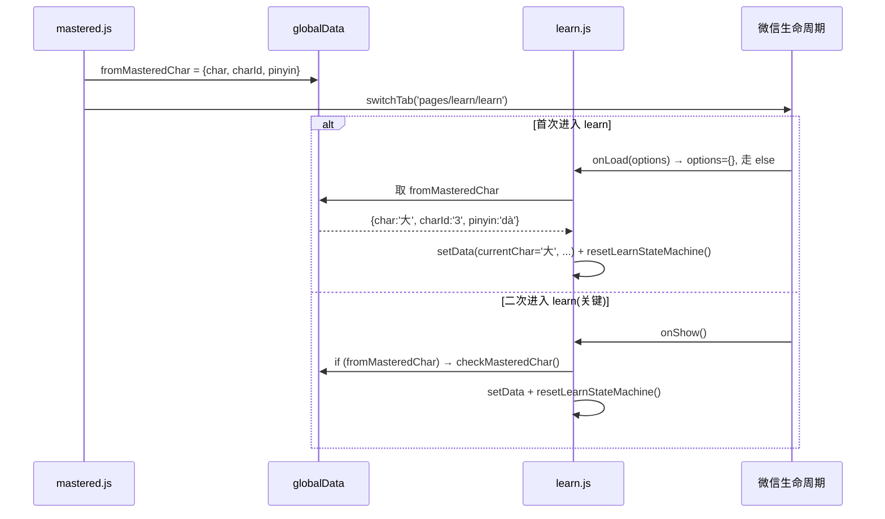

# V2.3 系统设计文档 — P0 安全/数据修复 + 架构加固

> **变更纪要** · 编写日期 2026-06-01
>
> 本文档记录 V2.2 → V2.3 的设计变更。**V2.3 不是新特性版本,是"救火+加固"版本**。V2.2 上线后被发现多个 P0 致命问题(密钥泄露、核心机制断链、假阳性数据),V2.3 的核心目标是止血和根除,V2.3.0 的"新功能"(resetUserData、清除数据按钮)是配套的安全运营工具。

---

## Part A: 系统设计

### 1. 变更背景

#### 1.1 V2.2 暴露的 P0 致命问题

| # | 问题 | 严重度 | 后果 |
|---|------|--------|------|
| C1 | 微信 AppSecret、百度 API Key/Secret **明文硬编码**在 `cloudfunctions/main/index.js` 第 9-14 行,且已 push 到 `feature/v2.1-asr-fallback` 公开分支 | 🔴 P0 | 任何能访问 git 仓库的人都能拿到生产环境的密钥,可滥用微信接口 + 刷百度语音额度 |
| C2 | `recordLearn` 只更新 `users.mastered_chars` 数组,**没有创建 `learning_progress` 记录** | 🔴 P0 | V2.2 的核心机制"间隔重复"对新字完全失效:`getPendingReview` 查 `learning_progress.next_review_date`,新字没记录,永远不进复习队列 |
| C3 | `getStats` / `getMasteredChars` 仍用 `users.mastered_chars` 数组统计"已掌握",而该数组被 V2.1 假阳性(Math.random() 判定)污染 56% | 🔴 P0 | 首页和列表页数字虚高,看似"已掌握 9 个字"实际能正确认出的不到一半,直接影响家长/老师对学习进度的判断 |
| C4 | 客户端 `getAudio` 不重试,百度 TTS 一次性 token 偶尔失效导致音频播放失败 | 🔴 P0 | 体验问题:跟读跟不上的字"沉默",家长以为程序坏了,实际是 token 失效 |

#### 1.2 V2.2 上线后暴露的 P1 严重 bug(同次修复)

| # | 问题 | 严重度 | 后果 |
|---|------|--------|------|
| C5 | tabBar 页面二次进入时,`onShow` 不消费 `app.globalData.fromMasteredChar`,从已掌握列表点哪个字都显示"一" | 🟠 P1 | 整个"已掌握 → 学习"功能路径断裂 |
| C6 | `checkMasteredChar` 切字时只更新字本身,**没有重置 25+ 个状态字段**,导致学完一个字后,再点其他字直接出现"学会了"弹窗 | 🟠 P1 | V2.2 四步状态机存在"跨字状态残留"问题 |
| C7 | 同 C6,但具体到 `dailyQuotaReached/Reason` 字段,留在 `loadChar` 私有重置里,`checkMasteredChar` 没重置,导致"今日新字已达标"卡片残留 | 🟠 P1 | 同样的状态残留问题 |
| C8 | `getStats` 用 `.where().count()` 配合 `_.in([...])` 抛异常,触发降级到 `mastered_chars` 数组兜底,导致首页显示 9 但列表显示 1 | 🟠 P1 | 即使做了 P0-3 的"已掌握按 learning_progress 查",仍可能因为 SDK 兼容性走降级路径 |

#### 1.3 框架与方案选择

| 决策点 | 方案 | 理由 |
|--------|------|------|
| 密钥管理 | **云函数环境变量** + 启动校验 | 微信云开发原生支持 `process.env`,启动时 `if (!xxx) throw` 兜底,缺变量直接 fail 不静默。比"代码里硬编码"安全一档,比"自己实现配置中心"轻一档 |
| 旧数据"已掌握" | **以 `learning_progress.status` 为唯一可信源**,`users.mastered_chars` 数组仅作冗余备份 | V2.1 假阳性污染了 `mastered_chars`,但 `learning_progress` 是 V2.2 上线后才有状态机驱动的,数据可信。两者冲突时以 `learning_progress` 为准 |
| 状态机残留 | **抽出 `resetLearnStateMachine()` 公共方法** | `loadChar` 和 `checkMasteredChar` 两个切字入口都通过 `Object.assign` 调它,未来新增"切字时需要清零"的字段只改一处 |
| 客户端 TTS 重试 | **新建 `utils/audio.js` 抽公共拉取+重试逻辑** | 3 个调用点(learn.js 的 `playAudio`/`playMiniReviewAudio`,review.js 的 `playAudio)都改用它,失败自动重试 1 次,第二次失败才走 fallback |
| 重置数据功能 | **云函数加 `resetUserData` action + settings 加"清除学习数据"按钮** | 修复上线后,用户需要"重新来过"的能力(从 V2.2 假阳性数据里脱出)。`resetUserData` 用 `cloud.getWXContext().OPENID` 锁定只清自己,加 `confirm` 二次确认;云端调试模式单独加 `devMode` 标记 |
| `getStats` 用 `.get().length` 而不是 `.count()` | 用 `.get().limit(1000)` + Set 去重 | `.count()` 对 `_.in([...])` 这类复杂查询支持差,会抛异常走降级。`.get().length` 兼容性 100% |

#### 1.4 架构模式

延续 V2.2 的"云函数为权威服务端"模式,核心变更:

1. **密钥从代码中剥离**:`cloudfunctions/main/index.js` 第 9-14 行从 `const WX_APPSECRET = '...'` 改为 `process.env.WX_APPSECRET`,启动时校验,缺则 `throw new Error`
2. **`recordLearn` 闭环扩展**:在原有"写 `users.mastered_chars` + 奖励"基础上,新增"同步创建/更新 `learning_progress` 记录"分支
3. **学习页公共 reset 方法**:`resetLearnStateMachine()` 返回 25+ 字段的统一初始值,`loadChar` 和 `checkMasteredChar` 通过 `Object.assign` 共用
4. **客户端音频抽象层**:`utils/audio.js` 提供 `playTTS(char, pinyin, onFallback)` 便捷方法,内置 1 次重试
5. **新增 `resetUserData` 云函数 action** + settings 入口

---

### 2. 文件列表

| 文件路径 | 操作 | 说明 |
|----------|------|------|
| `cloudfunctions/main/index.js` | 修改 | ① 密钥改 `process.env` + 启动校验 ② `recordLearn` 同步 learning_progress ③ `getStats` 改用 learning_progress 查 + 改 `.get().length` ④ `getMasteredChars` 改用 learning_progress 查 ⑤ 新增 `resetUserData` action |
| `pages/learn/learn.js` | 修改 | ① `onShow` 优先消费 `fromMasteredChar`(修 C5) ② `checkMasteredChar` 调 `resetLearnStateMachine()`(修 C6) ③ `loadChar` 改用 `Object.assign` + `resetLearnStateMachine()`(修 C7) ④ 新增 `resetLearnStateMachine` 公共方法 ⑤ `playAudio` 和 `playMiniReviewAudio` 改用 `TTS.playTTS`(修 C4) |
| `pages/review/review.js` | 修改 | `playAudio` 改用 `TTS.playTTS`(修 C4) |
| `pages/settings/settings.wxml` | 修改 | 加"清除学习数据"按钮 |
| `pages/settings/settings.wxss` | 修改 | 加 `.danger` 样式(浅黄底 + 橙色字) |
| `pages/settings/settings.js` | 修改 | 加 `confirmResetData`(二次确认)+ `doResetData`(调云函数 + 清本地 + 跳首页) |
| `utils/audio.js` | **新增** | TTS 拉取 + 自动重试(`playTTS` / `fetchTTS`) |
| `docs/CLAUDE.md` | 修改 | 路由清单 14→22,补 V2.3 工具章节,加 4 个新 bug 修复记录,加安全注意事项章节 |
| `README.md` | 修改 | 启动步骤加环境变量配置说明 |

---

### 3. 数据结构与接口

#### 3.1 learning_progress 字段(无新增,确认现有覆盖)

V2.2 的 `learning_progress` 字段已足够 V2.3 使用,不需要新增字段。但 V2.3 修复 C2 后,`recordLearn` 会**首次创建**该记录(之前完全没建),关键字段:
- `openid` / `char_id` / `status`(初值 `'seeing'`)
- `box_level`(由 `calculateNextReview(1, true)` 算出,初值 2)
- `next_review_date`(由 `calculateNextReview` 算出)
- `recognition_correct`(初值 1)/ `correct_count`(初值 1)/ `consecutive_correct`(初值 1)

#### 3.2 `getStats` 返回值变更(仅 1 个字段语义变化)

**`mastered_count` 字段计算源**:
- 之前:`users.mastered_chars` 数组长度,经 characters 表交叉比对
- **V2.3 起:** `learning_progress.status in ('familiar', 'mastered', 'solid')` 的 unique char_id 数量

**对前端影响:**
- 首页和"已掌握列表"页两边的数字现在来源相同,**自动一致**(这是 C3 修复历史中 2026-05-28 修复版本的彻底根因)
- 数字会"收紧":V2.1 假阳性的字不再算"已掌握",数字会下降。这是预期行为,Q-2 决策已记录

#### 3.3 `recordLearn` 内部新增 learning_progress 同步分支

```js
// V2.3 新增的核心 40 行
try {
  const charIdForProgress = charIdStr;
  const todayObj3 = new Date();
  const todayStr3 = todayObj3.getFullYear() + '-' + ...;

  // 查询是否已有 progress 记录
  const existProgressRes = await db.collection('learning_progress')
    .where({ openid, char_id: charIdForProgress })
    .get();

  if (existProgressRes.data && existProgressRes.data.length > 0) {
    // 已存在 → 只更新最近正确日期
    // ...
  } else {
    // 不存在 → 创建默认 progress + 算下次复习日期
    const defaultProgress = createDefaultProgress(openid, charIdForProgress);
    const next = calculateNextReview(1, true);
    defaultProgress.status = 'seeing';
    defaultProgress.box_level = next.boxLevel;
    defaultProgress.next_review_date = next.nextReviewDate;
    defaultProgress.recognition_correct = 1;
    defaultProgress.correct_count = 1;
    defaultProgress.consecutive_correct = 1;
    await db.collection('learning_progress').add({ data: defaultProgress });
  }
} catch (progressErr) {
  console.error('recordLearn: learning_progress 同步失败:', progressErr.message);
  // 不阻塞主流程(原有 mastered_chars 写入已成功)
}
```

#### 3.4 `resetUserData` action

```js
// 请求(客户端)
{ action: 'resetUserData', data: { confirm: true } }

// 请求(云端调试,无客户端登陆态)
{ action: 'resetUserData', data: { devMode: true, openid: 'xxx', confirm: true } }

// 返回
{
  success: true,
  openid: 'oXxx...',
  devMode: false,  // 客户端调用为 false,云端调试为 true
  deleted: {
    users: 1,
    learning_progress: 23,
    review_logs: 87,
    achievement_log: 3,
    reward_logs: 12
  }
}
```

**安全设计:**
- `confirm: true` 是必需参数,缺失直接 `return { success: false, error: '需要传 confirm: true 才执行重置' }`
- **生产路径(客户端调用)**:用 `cloud.getWXContext().OPENID`,**不接受** `data.openid`(防止客户端传别人 openid 删别人数据)
- **云端调试路径**:`devMode: true` + `data.openid`,需要显式标记
- 错误隔离:5 个集合逐个清空,某集合失败不影响其他集合
- 大集合分批删:`limit(100)` + 循环,避免超过云数据库单次删除 1000 条的限制

#### 3.5 云函数环境变量(新增)

| 变量 | 用途 | 配置位置 |
|------|------|----------|
| `WX_APPID` | 微信 AppID(公开值,不变) | 微信云开发控制台 → 云函数 → main → 配置 → 环境变量 |
| `WX_APPSECRET` | 微信 AppSecret(**必须重置**新值) | 同上 |
| `BAIDU_API_KEY` | 百度语音 API Key(**必须重置**新值) | 同上 |
| `BAIDU_SECRET_KEY` | 百度语音 Secret(**必须重置**新值) | 同上 |

**部署检查:** 部署新代码后,云函数启动时会 `if (!xxx) throw new Error(...)`,缺任何一个变量都会启动失败。这是故意的——**避免静默使用空值导致更难排查的运行时错误**。

---

### 4. 程序调用流程

#### 4.1 recordLearn 同步 learning_progress(C2 修复)



#### 4.2 客户端 TTS 重试(C4 修复)

```
playTTS(char, pinyin, onFallback):
  fetchTTS(char, pinyin, retryLeft=1, onSuccess, onFail):
    wx.cloud.callFunction('getAudio', {char, pinyin})
    
    success:
      if result.success && result.audioUrl:
        onSuccess(audioUrl)  # 播放
      else if retryLeft > 0:
        fetchTTS(char, pinyin, retryLeft - 1, ...)  # 递归重试
      else:
        onFail()
    
    fail:
      同上递归重试

  onSuccess:
    audio = createInnerAudioContext
    audio.src = url
    audio.play()
    audio.onError → onFallback()

  onFail or onFallback:
    showFeedback('info', '📖', pinyin)  # 显示拼音文字
```

#### 4.3 tabBar 页面 fromMasteredChar 消费(C5 修复)



#### 4.4 状态机切字公共 reset(C6/C7 修复)

```js
// pages/learn/learn.js
resetLearnStateMachine: function() {
  return {
    currentStep: 1,
    stepCompleted: [false, false, false, false],
    stepResults: [{}, {}, {}, {}],
    learnCompleted: false,
    finalResult: null,
    feedbackShow: false,
    // Step2/3/4 各步骤状态...
    // R-13 每日配额:
    dailyQuotaReached: false,
    dailyQuotaReason: ''
    // 共 25+ 字段
  };
},

// checkMasteredChar(从已掌握进入)
this.setData(Object.assign({
  currentChar, charId, pinyin, fromMastered: true, loading: false
}, this.resetLearnStateMachine()));

// loadChar(新字学习)
self.setData(Object.assign({
  loading: true, cardEntrance: false, charProgress: null
}, self.resetLearnStateMachine()));
```

**设计要点:** `loading` 是切字入口自己设(两者不同:checkMasteredChar=false,loadChar=true),`resetLearnStateMachine` 不包含 `loading`,留给调用方决定。

---

### 5. 风险与回滚

#### 5.1 部署期间的"已掌握"数字变化

**现象:** 部署 V2.3 后,首页和列表页"已掌握"数字会**下降**(V2.1 假阳性的字不再算)。

**根因:** P0-3 把"已掌握"的定义从 `users.mastered_chars` 数组改为 `learning_progress.status in [familiar, mastered, solid]`。老的 56% 假阳性字没有 learning_progress 记录,迁移脚本 `migrateProgress` 会把它们映射为 familiar(用户首次访问首页触发)。

**用户感知:**
- 迁移前(几秒):首页显示老数字(虚高)
- 迁移后:数字下降,但**准确**

**应对:**
- 提前告知家长"数据会更准确,字数量会调整"(在 V2.3 发布说明里)
- `migrateProgress` 的 `correct_count=5` 映射保证老字不会被降为 `new` 状态,只是回到 familiar 起点

#### 5.2 密钥环境变量未配置导致云函数启动失败

**现象:** 部署 V2.3 后,小程序任何操作都报错"请在云函数环境变量中配置 WX_APPSECRET"。

**根因:** V2.3 改成 `if (!process.env.WX_APPSECRET) throw new Error(...)`,缺变量直接 fail。

**回滚(临时):** 把 V2.2 之前的 commit 部署回来(老代码硬编码密钥),但这意味着**使用已泄露的密钥**。**强烈不建议回滚**。

**正确恢复路径:** 在云开发控制台配齐 4 个环境变量,重新部署。无需回滚代码。

#### 5.3 学习页状态字段遗漏(防患于未然)

**应对机制:** 所有"切字时需要清零"的字段集中到 `resetLearnStateMachine()`。**未来添加新状态字段时,只需要在 data 初始值 + resetLearnStateMachine 返回值两处都加**,避免遗漏。

**review.js 的对等修复:** review.js 在 `showCurrentQuestion` 里有自己的大 setData 覆盖(行 151-188),目前未抽出 `resetReviewState`。**P1 待办**:抽出 `resetReviewState()` 与 `resetLearnStateMachine()` 风格对齐。

---

### 6. 待确认/假设/Non-goals

| # | 项 | 处理方式 |
|---|-----|---------|
| U1 | V2.1 之前的 review_logs 数据如何处理 | R-16 `cleanReviewLogs` 已打 `data_quality="unreliable_pre_fix"` 标签。V2.3 的 `getStats`/`getMasteredChars` 改用 learning_progress 后,**实际上绕开了 review_logs**。V2.1 假阳性"已掌握"问题通过 P0-3 修复彻底绕开,无需再依赖 review_logs 字段 |
| U2 | `getStats` 走 `.get().length` 性能 | 假设用户的 progress 记录数 < 1000。如果未来用户量增长,需要加索引:`learning_progress.{openid: 1, status: 1}` 复合索引 |
| U3 | `resetUserData` 软删除 | 暂未做,**目前是硬删除**。如果要加"30 天可恢复",需要新增 `deleted_at` 字段,定时清理脚本。**P3 待办** |
| U4 | `resetUserData` 误操作 | 已有 `confirm: true` 二次确认,云端调试模式有 `devMode` 显式标记。**生产调用方**(settings.js 按钮)有 `wx.showModal` 二次弹窗,误触概率低 |

---

## Part B: 任务分解(参考性,V2.3 已实施)

### 7. 已完成项

| ID | 任务 | 状态 | 涉及文件 |
|----|------|------|----------|
| T01 | 密钥改环境变量 + 启动校验 | ✅ | `cloudfunctions/main/index.js` |
| T02 | `recordLearn` 同步 learning_progress | ✅ | `cloudfunctions/main/index.js` |
| T03 | `getStats`/`getMasteredChars` 改用 learning_progress 查 | ✅ | `cloudfunctions/main/index.js` |
| T04 | `getStats` 用 `.get().length` 替代 `.count()` | ✅ | `cloudfunctions/main/index.js` |
| T05 | 客户端 TTS 重试工具 | ✅ | `utils/audio.js`(新增) |
| T06 | learn.js 切换 audio 调用 | ✅ | `pages/learn/learn.js` |
| T07 | review.js 切换 audio 调用 | ✅ | `pages/review/review.js` |
| T08 | 状态机公共 reset 方法 | ✅ | `pages/learn/learn.js` |
| T09 | `onShow` 优先消费 fromMasteredChar | ✅ | `pages/learn/learn.js` |
| T10 | 云函数 `resetUserData` action | ✅ | `cloudfunctions/main/index.js` |
| T11 | settings 加"清除学习数据"按钮 | ✅ | `pages/settings/settings.{wxml,wxss,js}` |
| T12 | 文档同步(CLAUDE.md / README.md) | ✅ | `docs/CLAUDE.md` / `README.md` |

### 8. 未处理(P1/P2/P3 排期建议)

| ID | 任务 | 优先级 | 估时 | 备注 |
|----|------|--------|------|------|
| T13 | `resetReviewState()` 抽出(对齐 `resetLearnStateMachine`) | 🟠 P1 | 1h | review.js `showCurrentQuestion` 仍是大 setData 覆盖,易遗漏字段 |
| T14 | `learning_progress.{openid, status}` 复合索引 | 🟠 P1 | 30min | 大用户量必需,目前可接受 |
| T15 | `sendReviewReminder` 串行推送改批处理 | 🟠 P1 | 1h | 100 用户串行 60s 超时风险 |
| T16 | git 历史密钥清理(`git filter-repo`) | 🟠 P1 | 用户执行 | 我不能代做危险操作 |
| T17 | 主云函数按域拆分(user.js / char.js / review.js ...) | 🟡 P2 | 半天 | 2077 行 → 可读性 0 |
| T18 | `stroke-data.js` 拆分(1.6MB 接近 2MB 上限) | 🟡 P2 | 1天 | V2.3 描红强化前必须 |
| T19 | `getMasteredChars` 软删除(30 天可恢复) | 🟡 P3 | 半天 | 防误操作 |
| T20 | ESLint / Prettier 配置 | 🟢 P3 | 半天 | 单人 + AI 协作有 lint 更稳 |
| T21 | review.js `closeFeedback` 定时器统一清理 | 🟢 P3 | 30min | 多个 setTimeout 满天飞 |

---

### 9. 共享知识(V2.3 新增)

```
- 密钥用云函数环境变量,代码里 throw new Error 兜底,缺则 fail-fast
  (优于"硬编码"和"自己实现配置中心"两端折中)
- 切字必重置:learn / review 等页面切字时调公共 reset 方法
  (避免上一个字的状态残留,典型 bug:学完一个字直接进入下一个字,
  出现"学会了"弹窗)
- 客户端外部 API 调用必须有重试(百度 TTS token 偶尔失效)
  → 抽 utils/audio.js 公共处理
- 状态机相关的"权威服务端"设计仍然有效:spaced-repetition 算法内嵌
  在云函数,前端 utils/spaced-repetition.js 用于本地预判,服务端为准
- 用户级危险操作(resetUserData)必须用 cloud.getWXContext().OPENID
  锁定,不能信任 data.openid
- V2.1 之前的 review_logs 数据标 data_quality="unreliable_pre_fix"
  后实际绕开使用,靠 learning_progress 重塑可信数据源
- getStats / getMasteredChars 改用 learning_progress 查后,
  首页和列表页的"已掌握"数字自动一致(CLAUDE.md L177 修复历史中的
  "mastered_chars 计数不一致" bug 因此彻底根除)
```

---

## 版本记录

| 版本 | 日期 | 修订人 | 备注 |
|------|------|--------|------|
| V2.3 | 2026-06-01 | Mavis + 用户协作 | P0 安全/数据修复 + 架构加固。**V2.3 不是新特性版本,是救火+加固** |
